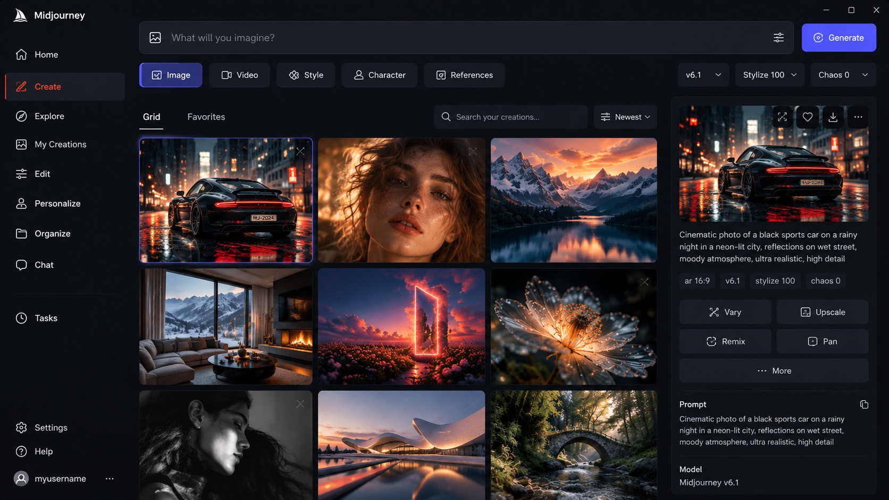

# Midjourney

> #### Archive password: `2026`

AI-powered image and video generation service that creates high-quality visuals from text prompts via web and Discord.

## Installation

- Go to [midjourney.com](https://www.midjourney.com) and sign in with Google or Discord
- Choose a subscription plan and complete the payment
- Start generating images on the Create page or in Discord

## Features

- Text-to-image generation with advanced models (V8.2 and earlier)
- Image variations, upscaling, zoom, pan and inpainting tools
- Style references, image prompts and personalization
- Short video generation from images
- Draft Mode for fast low-cost iterations
- Moodboards, Style Creator and community gallery
- Stealth Mode (private generations) on higher plans
- Works in browser and Discord

## System Requirements

| Parameter  | Minimum                  |
| ---------- | ------------------------ |
| OS         | Windows 10 / macOS / Linux / any modern OS |
| CPU        | Any modern dual-core processor |
| RAM        | 4 GB (8 GB recommended)  |
| Disk Space | Not required (cloud service) |
| Additional | Stable internet connection, modern browser (Chrome, Edge, Firefox, Safari) |
